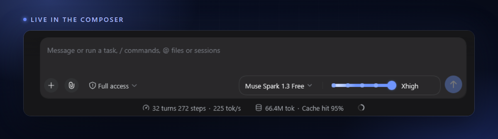
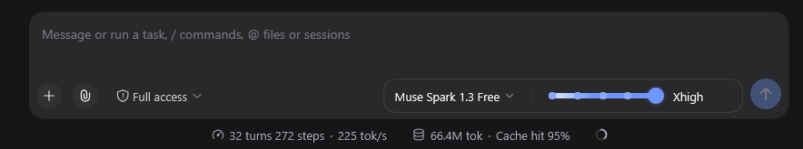
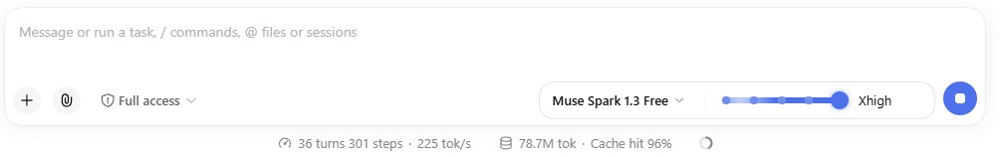

# Effort Slider for DeepSeek Harness


**English** | [中文](README.zh.md)

A reasoning-effort slider for [DeepSeek Harness (DSH)](https://github.com/deepseek-ai/deepseek-harness) that lives in the composer. Codex and Claude Code have one. DSH didn't, so I built it. One pill holds the model picker and the slider, right where you type.



| Dark | Light |
| ---- | ----- |
|  |  |

## Features

- **One pill for model and effort.** Picker and slider share one bordered pill with a separator between them. The slider sits right of the model name.
- **The model list skips the submenu.** One click shows every provider and model. Effort stays on the slider and nowhere else.
- **Notches instead of a smooth drag.** Each notch is a real effort level from the model, usually two to seven. Drag it, or focus it and use the arrows, Home, End. Screen readers get a real slider role.
- **A little show at the top notch.** Max effort turns the bar into a moving gradient, a nod to DSH's own "Deep diving..." shimmer. It stays still when you prefer reduced motion.
- **It follows your theme.** Every color comes from DSH variables, with one accent shared with the send button. Light, dark, future theme plugins, it all carries over.
- **It speaks your language.** Labels follow the DSH locale in English, French and Chinese. Model and effort names stay exactly as the model sends them.
- **The context ring gets out of the way.** While the pill is up, the ring moves to the end of the stats row instead of crowding the send button.
- **A taller prompt box.** About two lines, same as the DSH hero input.
- **Nothing lives in core.** The plugin is one folder. Delete it and DSH forgets it was there.

## Requirements

DSH with the `web` profile, and a model that exposes reasoning efforts. No effort levels, no slider. Anything with `low / medium / high` works.

## Compatibility and permissions

Needs the `web` profile (composer slots, model directory, locale). Pure client UI. No host permissions, no network calls, no external services. Tested on DSH `0.1.2-alpha`.

## Install

From GitHub, no npm account needed:

```sh
dsh plugin --profile web add github:mrSutivu/plugin-effort-slider
```

Or clone it first:

```sh
git clone https://github.com/mrSutivu/plugin-effort-slider.git
dsh plugin --profile web add ./plugin-effort-slider
```

Then restart the `web` profile once with `dsh web` and refresh the page. Later client-only edits apply on a plain refresh.

From npm:

```sh
dsh plugin --profile web add plugin-effort-slider
```

## Usage

1. Pick a reasoning model in the pill.
2. Drag the slider and let go. It applies on release.
3. Push it to the top notch for the gradient.

If the model has no reasoning levels, the pill hides and the stock DSH selector is back.

## Theming

Everything runs off one accent, `var(--dsw-alias-button-info-fill)`, the send button fill. A theme plugin that redefines it recolors the slider, the notches, the max gradient and the checkmark. Nothing else to touch.

## i18n

Strings live under the `effort-slider` locale namespace in English, French and Chinese. To add your language, register dictionaries for that namespace and open a PR. `locale.addLanguage` covers you if the language pack itself is missing.

## Uninstall

```sh
dsh plugin --profile web remove plugin-effort-slider
```

Restart `dsh web` once. The pill, the styles, the meter move and the prompt height all revert.

## Dev

No build. Edit `lib/client.js` and refresh. `lib/index.js` is an empty host entry. The bundle layer wants one, so it gets one.

## Contributing

Issues and PRs welcome. New locale dictionaries make the easiest first contribution. Theme edge cases and provider quirks matter most, since effort counts differ per model.

## License

MIT © Sutivu
